# SignWriting Evaluation

The lack of automatic SignWriting evaluation metrics is a major obstacle in the development of
SignWriting transcription and translation[^1] models.

## Goals

The primary objective of this repository is to house a suite of
automatic evaluation metrics specifically tailored for SignWriting.
This includes standard metrics like BLEU[^2], chrF[^3], and CLIPScore[^4],
as well as custom-developed metrics unique to our approach.
We recognize the distinct challenges in evaluating single signs versus continuous signing,
and our methods reflect this differentiation.

To qualitatively demonstrate the efficacy of these evaluation metrics,
we implement a nearest-neighbor search for selected signs from the SignBank corpus.
The rationale is straightforward: the closer the sign is to its nearest neighbor in the corpus,
the more effective the evaluation metric is in capturing the nuances of sign language transcription and translation.

## Evaluation Metrics

- [Tokenized BLEU](signwriting_evaluation/metrics/bleu/bleu.py) - BLEU score for tokenized SignWriting FSW strings.
- [chrF](signwriting_evaluation/metrics/chrf/chrf.py) - chrF score for untokenized SignWriting FSW strings.
- [CLIPScore](signwriting_evaluation/metrics/clip/clip.py) - CLIPScore between SignWriting images. (Using the original CLIP model)
- [Similarity](signwriting_evaluation/metrics/similarity/similarity.py) - symbol distance score for SignWriting FSW strings.
- [Similarity v2](signwriting_evaluation/metrics/similarity_v2/similarity_v2.py) - the improved, name-aware symbol distance [(README)](signwriting_evaluation/metrics/similarity_v2/similarity_v2.md).

## Qualitative Evaluation

### Distribution of Scores

Using a sample of the corpus, we compute the any-to-any scores for each metric.
Intuitively, we expect a good metric given any two random signs to produce a bad score, since most signs are unrelated.
This should be reflected in the distribution of scores, which should be skewed towards lower scores.

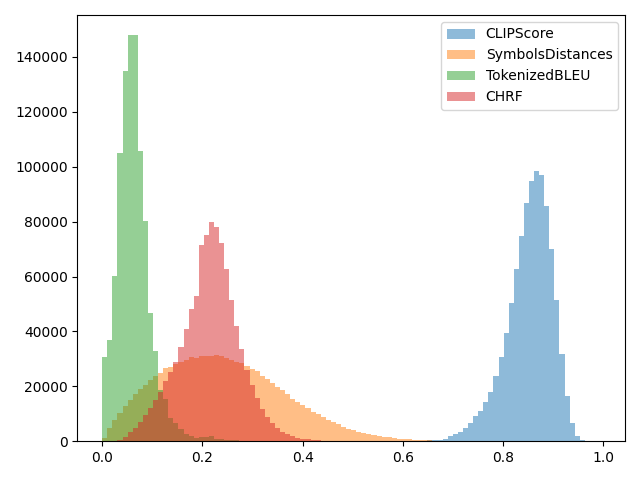

### Nearest Neighbor Search

It is well-known that the SignBank corpus contains many forms of the sign for "hello".
We carefully select some of these signs to evaluate our metrics, by looking for their closest matches in the corpus,
which contains around 230k single signs.

The problems of each metric are revealed when comparing the top 10 nearest neighbors for each sign.
For each sign and metric, either the first match is incorrect, or there is a more correct match further down the list.
The table compares the name-aware Similarity v2, the original Similarity, Tokenized BLEU, and chrF;
CLIPScore is omitted here, as encoding ~230k SignWriting images per query is prohibitively slow.

<table style="text-align: center">
<thead>
<tr><td></td><td colspan='4'></td><td colspan='4'></td><td colspan='4'></td></tr>
<tr><td></td><td>SymbolsDistancesV2</td><td>SymbolsDistances</td><td>TokenizedBLEU</td><td>CHRF</td><td>SymbolsDistancesV2</td><td>SymbolsDistances</td><td>TokenizedBLEU</td><td>CHRF</td><td>SymbolsDistancesV2</td><td>SymbolsDistances</td><td>TokenizedBLEU</td><td>CHRF</td></tr>
</thead>
<tbody>
<tr><td>1</td><td>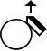</td><td></td><td></td><td></td><td></td><td></td><td></td><td></td><td></td><td></td><td></td><td></td></tr>
<tr><td>2</td><td>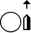</td><td>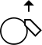</td><td></td><td></td><td></td><td></td><td></td><td></td><td></td><td></td><td></td><td></td></tr>
<tr><td>3</td><td></td><td></td><td></td><td></td><td></td><td></td><td></td><td></td><td></td><td></td><td></td><td></td></tr>
<tr><td>4</td><td>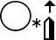</td><td></td><td>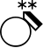</td><td></td><td></td><td></td><td></td><td></td><td></td><td></td><td></td><td></td></tr>
<tr><td>5</td><td>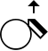</td><td></td><td></td><td></td><td></td><td></td><td></td><td></td><td>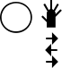</td><td></td><td></td><td></td></tr>
<tr><td>6</td><td>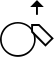</td><td></td><td>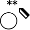</td><td></td><td></td><td></td><td></td><td></td><td>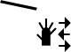</td><td></td><td></td><td>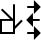</td></tr>
<tr><td>7</td><td></td><td></td><td>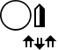</td><td></td><td></td><td></td><td>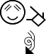</td><td></td><td></td><td></td><td></td><td></td></tr>
<tr><td>8</td><td></td><td></td><td>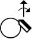</td><td></td><td></td><td></td><td></td><td></td><td></td><td></td><td></td><td></td></tr>
<tr><td>9</td><td></td><td></td><td>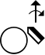</td><td></td><td></td><td></td><td></td><td></td><td></td><td></td><td></td><td></td></tr>
<tr><td>10</td><td>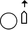</td><td>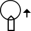</td><td></td><td></td><td></td><td></td><td></td><td></td><td></td><td></td><td></td><td>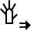</td></tr>
</tbody>
</table>

## Cite
If you use our toolkit in your research or projects, please consider citing the work.

```bib
@misc{signwriting-evaluation2024,
    title={SignWriting Evaluation: Metrics for Evaluating SignWriting Transcription and Translation Models},
    author={Moryossef, Amit and Zilberman, Rotem and Langer, Ohad},
    howpublished={\url{https://github.com/sign-language-processing/signwriting-evaluation}},
    year={2024}
}
```

## References

[^1]: Amit Moryossef, Zifan Jiang.
      2023. [SignBank+: Preparing a Multilingual Sign Language Dataset for Machine Translation Using Large Language Models](https://arxiv.org/abs/2309.11566).
[^2]: Kishore Papineni, Salim Roukos, Todd Ward, and Wei-Jing Zhu.
      2002. [Bleu: a Method for Automatic Evaluation of Machine Translation](https://aclanthology.org/P02-1040/). In
      Proceedings of the 40th Annual Meeting of the Association for Computational Linguistics, pages 311–318,
      Philadelphia,
      Pennsylvania, USA. Association for Computational Linguistics.
[^3]: Maja Popović.
      2015. [chrF: character n-gram F-score for automatic MT evaluation](https://aclanthology.org/W15-3049/). In Proceedings
      of the Tenth Workshop on Statistical Machine Translation, pages 392–395, Lisbon, Portugal. Association for
      Computational
      Linguistics.
[^4]: Jack Hessel, Ari Holtzman, Maxwell Forbes, Ronan Le Bras, and Yejin Choi.
      2021. [CLIPScore: A Reference-free Evaluation Metric for Image Captioning](https://aclanthology.org/2021.emnlp-main.595/).
      In Proceedings of the 2021 Conference on Empirical Methods in Natural Language Processing, pages 7514–7528, Online
      and Punta Cana, Dominican Republic. Association for Computational Linguistics.
